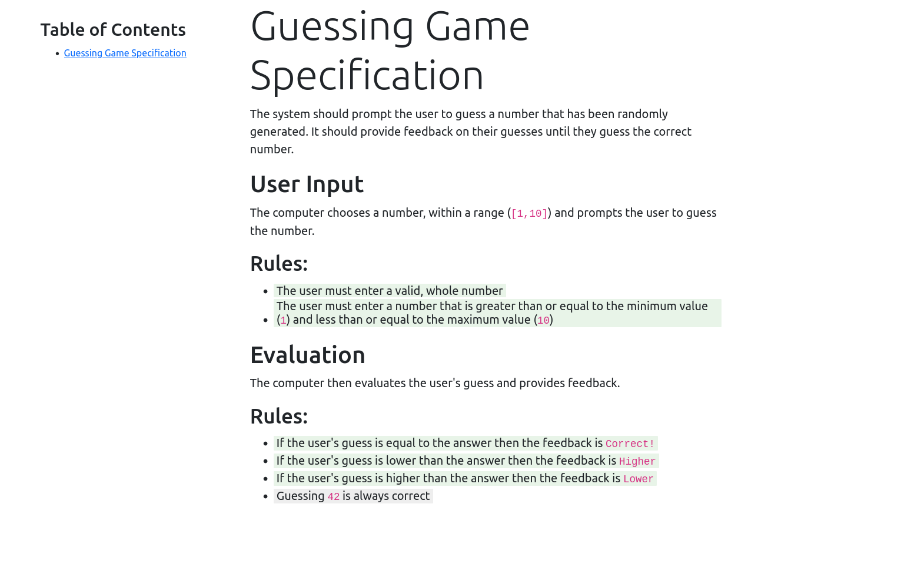

<h1 style="font-size: 60px; font-family: 'Averia Serif Libre', serif; font-weight: 700; font-style: italic; color: #209cee">blprnt</h1>

> See what your software should do, what it does, and what are the differences.

*blprnt* is a tool for creating and verifying software specifications. Each assertion in your specification can be linked to a test and verified automatically.

The goal of *blprnt* is to stay out of the way.

It lets you right your specification however you like. It lets you right your tests however you like. Then *blprnt* lets you use your tests to verify your specification.

### An Example of a Verified Specification

## Benefits

* Help teams to think about what to build before building it.
* Maintain an accurate specification of software systems as a basis for ongoing development.
* The tools necessary to keep a specification up-to-date and accurate.

## Features

* Specification creation and browsing.
* Ability to verify each assertion in a specification using automated tests - to show that the system works as specified and that the specification remains accurate. 
* Aggregation of specification components to see which parts of the system are working, broken or not yet implemented. 